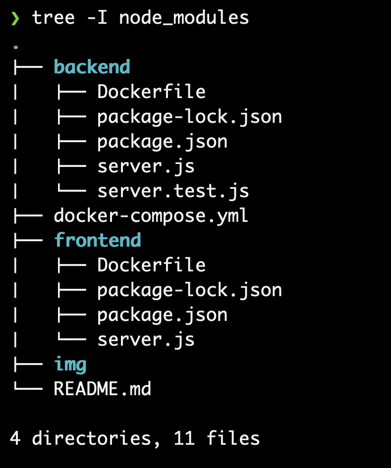
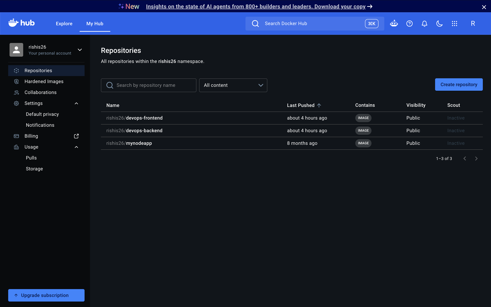
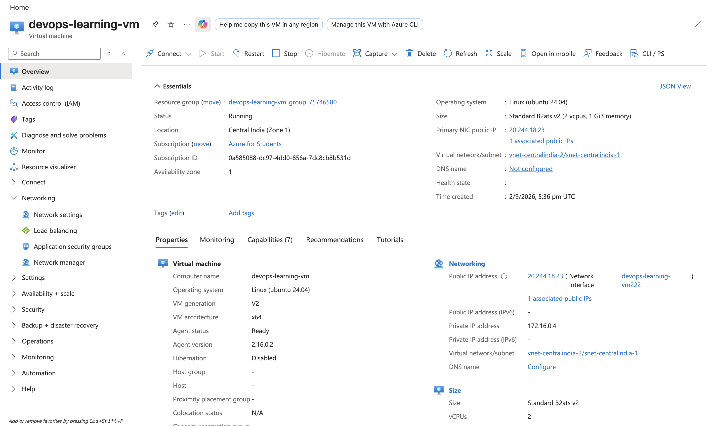
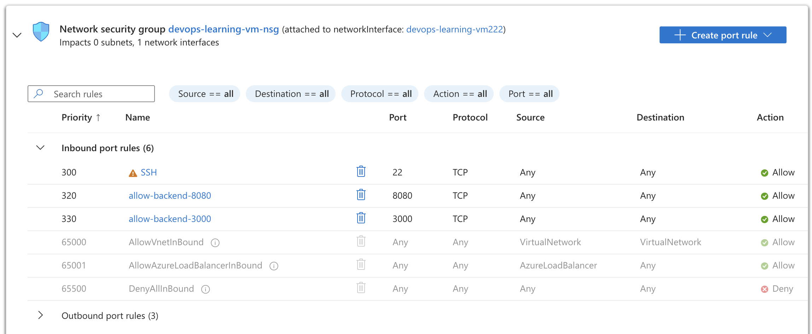
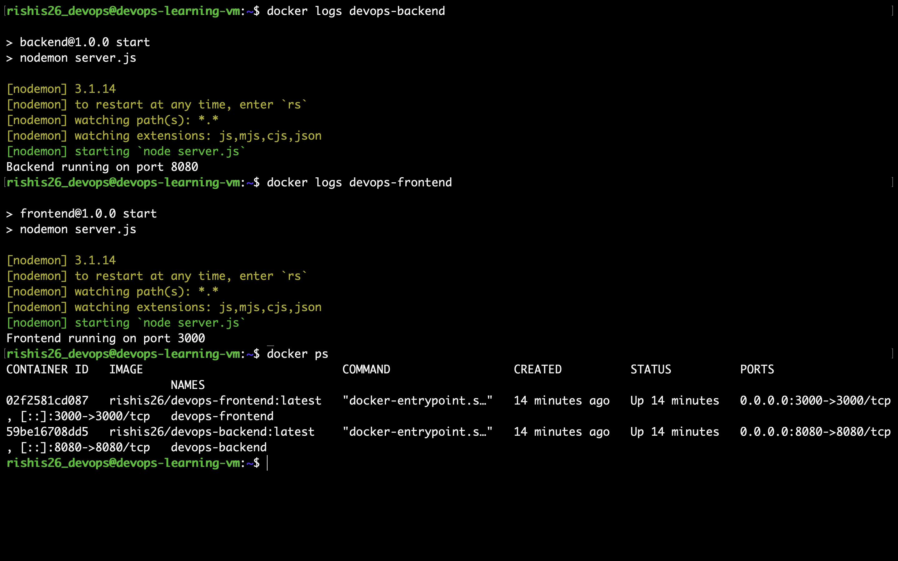
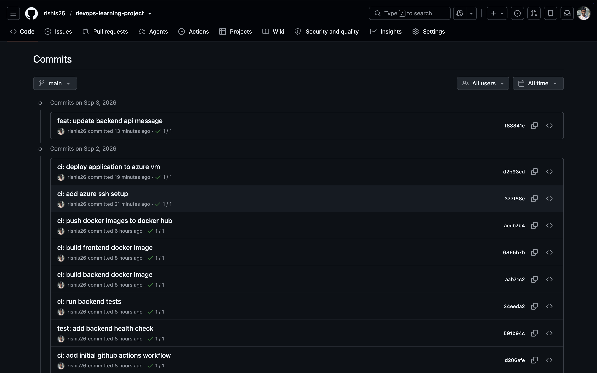
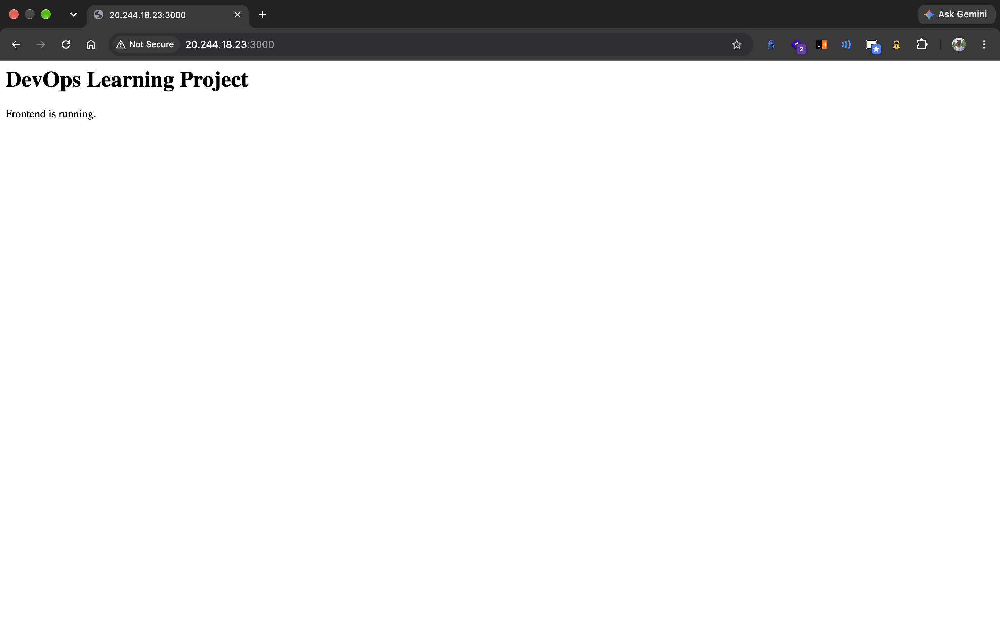
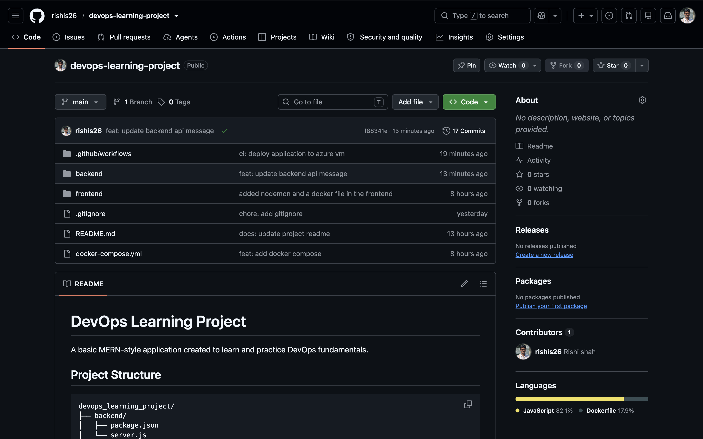

# DevOps Learning Project

A hands-on DevOps learning project built around a simple MERN-style application.

The application itself is intentionally simple. The goal of this project was to understand the **DevOps workflow from source code to automated deployment** rather than build a complex application.

<p align="left">
  <a href="https://skillicons.dev">
    
  </a>
</p>

---

##  What This Project Demonstrates

- Git and GitHub
- Meaningful incremental commits
- GitHub Actions
- Continuous Integration (CI)
- Continuous Deployment (CD)
- Node.js and Express
- Docker
- Docker images and containers
- Docker Hub as a container registry
- Linux / Ubuntu
- SSH
- Azure Virtual Machine
- Azure Network Security Groups
- Automated deployment to a VM
- Container restart policies
- Container logs and runtime verification

---

##  Architecture

```text
                         DEVELOPER
                             │
                             │ git push
                             ▼
                      ┌─────────────┐
                      │   GitHub    │
                      │ Source Code │
                      └──────┬──────┘
                             │
                             ▼
                   ┌──────────────────┐
                   │  GitHub Actions  │
                   │                  │
                   │ • Install deps   │
                   │ • Run tests      │
                   │ • Build images   │
                   │ • Push images    │
                   │ • Deploy         │
                   └────────┬─────────┘
                            │
                            ▼
                    ┌──────────────┐
                    │  Docker Hub  │
                    │              │
                    │ backend img  │
                    │ frontend img │
                    └──────┬───────┘
                           │
                       docker pull
                           │
                           ▼
                    ┌──────────────┐
                    │   Azure VM   │
                    │ Ubuntu Linux │
                    └──────┬───────┘
                           │
                         Docker
                           │
                  ┌────────┴────────┐
                  ▼                 ▼
          ┌──────────────┐   ┌──────────────┐
          │   Backend    │   │   Frontend   │
          │   :8080      │   │   :3000      │
          └──────────────┘   └──────────────┘
                  │                 │
                  └────────┬────────┘
                           ▼
                         Users
```

---

##  Project Structure

```text
devops_learning_project/
├── README.md
├── backend/
│   ├── Dockerfile
│   ├── package-lock.json
│   ├── package.json
│   ├── server.js
│   └── server.test.js
├── frontend/
│   ├── Dockerfile
│   ├── package-lock.json
│   ├── package.json
│   └── server.js
├── docker-compose.yml
└── .github/
    └── workflows/
        └── ci.yml
```

The repository also contains an `img/` directory used by this README for project screenshots.



---

##  Technologies Used

<p align="left">
  
</p>

| Technology | Purpose |
| :--- | :--- |
|  | Version control |
|  | Source-code repository |
|  | CI/CD automation |
|  | Application runtime |
|  | Backend and frontend HTTP servers |
|  | Containerization |
|  | Container image registry |
|  | VM operating system |
|  | Application runtime/server |
|  | Secure remote access and deployment |
|  | Network access control |

---

##  CI/CD Pipeline

The central objective of the project was to understand what happens after:

```bash
git push origin main
```

The workflow is:

```text
Code Change
    │
    ▼
git push origin main
    │
    ▼
GitHub
    │
    ▼
GitHub Actions Runner
    │
    ├── Checkout repository
    ├── Setup Node.js
    ├── Install dependencies
    ├── Run backend tests
    ├── Build backend Docker image
    ├── Build frontend Docker image
    ├── Login to Docker Hub
    ├── Push Docker images
    ├── Setup SSH
    └── Deploy to Azure VM
              │
              ▼
        Azure VM pulls images
              │
              ▼
        Old containers removed
              │
              ▼
        New containers started
              │
              ▼
          Application live
```

---

##  Continuous Integration

GitHub Actions runs the CI part on a temporary Ubuntu runner.

It:

1. Checks out the repository.
2. Installs Node.js.
3. Installs backend dependencies.
4. Installs frontend dependencies.
5. Runs the backend health-check test.
6. Builds both Docker images.

If the tests or Docker builds fail, the deployment should not proceed.

### The important concept I learned

**GitHub Actions provides temporary compute for testing and building the application.**

It is not the server where my application continuously runs.

---

##  Docker

Docker packages the applications into container images.

The basic flow is:

```text
Source Code
     │
     ▼
 Dockerfile
     │
     ▼
 Docker Image
     │
     ▼
 Docker Container
     │
     ▼
Running Application
```

The project produces two images:

```text
rishis26/devops-backend:latest
rishis26/devops-frontend:latest
```

Docker Hub stores these images so the Azure VM can pull them during deployment.



---

##  Azure Deployment

The application runs on an Ubuntu Linux virtual machine in Azure.

### VM

- VM: `devops-learning-vm`
- OS: Ubuntu 24.04
- Size: Standard B2ats v2
- Architecture: x64
- Region: Central India
- Docker installed and running



### Runtime compute

The **Azure VM is the persistent compute** for the application.

Unlike the temporary GitHub Actions runner, the VM stays available and runs the Docker containers.

```text
Azure VM
   │
   └── Docker
        ├── devops-backend
        │      └── Node.js application :8080
        │
        └── devops-frontend
               └── Node.js application :3000
```

---

##  Network Configuration

Azure Network Security Group rules were configured to allow the application ports and SSH access.

| Port | Protocol | Purpose |
| :--- | :--- | :--- |
| 22 | TCP | SSH |
| 3000 | TCP | Frontend |
| 8080 | TCP | Backend |



> For a real production deployment, inbound application ports should be restricted appropriately and HTTPS/reverse-proxy architecture would normally be considered. This project intentionally keeps the setup simple for learning.

---

##  Running Containers on the VM

After deployment, the Azure VM runs both containers:

```text
devops-backend
devops-frontend
```

with the following port mappings:

```text
8080 → backend
3000 → frontend
```



The containers were configured with:

```bash
--restart unless-stopped
```

This means Docker will automatically restart the containers after an unexpected Docker/VM restart, unless the containers were explicitly stopped.

---

##  Container Logs

The containers can be inspected using:

```bash
docker logs devops-backend
docker logs devops-frontend
```

The backend reports:

```text
Backend running on port 8080
```

and the frontend reports:

```text
Frontend running on port 3000
```

This confirms that the applications are not merely built as images --- they are actually running inside containers on the Azure VM.

---

##  SSH and Deployment

GitHub Actions connects to the Azure VM using SSH.

The private SSH key is stored as a **GitHub Actions secret** rather than being committed to the repository.

The deployment process performed by GitHub Actions is essentially:

```bash
docker pull rishis26/devops-backend:latest
docker pull rishis26/devops-frontend:latest

docker stop devops-backend || true
docker rm devops-backend || true

docker stop devops-frontend || true
docker rm devops-frontend || true

docker run -d \
  --name devops-backend \
  --restart unless-stopped \
  -p 8080:8080 \
  rishis26/devops-backend:latest

docker run -d \
  --name devops-frontend \
  --restart unless-stopped \
  -p 3000:3000 \
  rishis26/devops-frontend:latest
```

No SSH private key, Docker Hub token, or other secret is stored in the repository.

---

##  Git Workflow

I used small, meaningful commits throughout the project instead of making one large commit at the end.

Examples include:

```text
feat: add backend api
feat: add frontend service
feat: dockerize backend
feat: dockerize frontend
feat: add docker compose
ci: add initial github actions workflow
test: add backend health check
ci: run backend tests
ci: build backend docker image
ci: build frontend docker image
ci: push docker images to docker hub
ci: add azure ssh setup
ci: deploy application to azure vm
feat: update backend api message
```

This made it possible to see how the project evolved from a basic application into a deployed DevOps workflow.



---

##  What I Understand Now

This project helped me understand the difference between several concepts that can initially look similar.

### GitHub vs Docker Hub vs Azure

**GitHub**

```text
Source code
```

**Docker Hub**

```text
Built container images
```

**Azure VM**

```text
Running application
```

### GitHub Actions vs Azure VM

The most important distinction I learned:

> **GitHub Actions uses temporary compute to test, build and deploy the application. Azure VM provides the persistent compute where the application actually runs and serves users.**

So when a user requests:

```text
http://<VM-IP>:8080
```

the request goes to:

```text
Internet
   ↓
Azure VM
   ↓
Docker
   ↓
Backend container
   ↓
Node.js / Express
   ↓
Response
```

GitHub Actions is not serving that request.

---

##  End-to-End Deployment Proof

To verify that the entire pipeline actually worked, I changed the backend response from:

```text
DevOps Learning Project API
```

to:

```text
DevOps Learning Project API v2
```

After pushing the change to `main`:

```text
GitHub
   ↓
GitHub Actions
   ↓
Tests passed
   ↓
Docker images rebuilt
   ↓
Docker Hub updated
   ↓
Azure VM pulled new images
   ↓
Containers recreated
   ↓
Live API returned v2
```



This was the final proof that the automated deployment was working end-to-end.

---

##  Repository

The project source code, Git history, workflow and configuration are available in this repository:

**GitHub:** `rishis26/devops-learning-project`



---

##  Final Learning Outcome

The purpose of this project was not to create a complex application.

The purpose was to understand the **complete DevOps delivery pipeline**:

```text
Write Code
    ↓
Git
    ↓
GitHub
    ↓
GitHub Actions
    ↓
Test
    ↓
Docker Build
    ↓
Docker Hub
    ↓
Azure VM
    ↓
Docker Containers
    ↓
Running Application
```

I can now explain where the code is tested, where Docker images are built and stored, where deployment happens, and where the application actually runs.

---

##  Project Status

**Completed --- End-to-end CI/CD deployment working successfully.**
